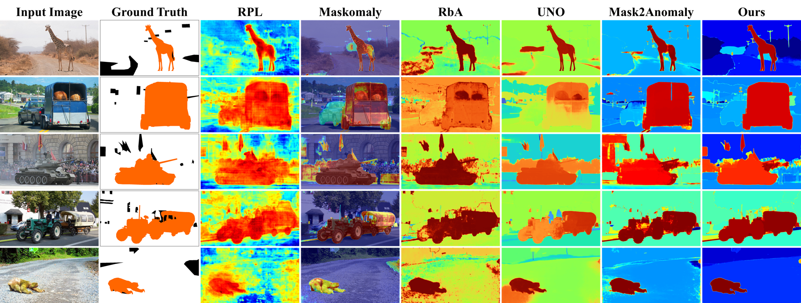
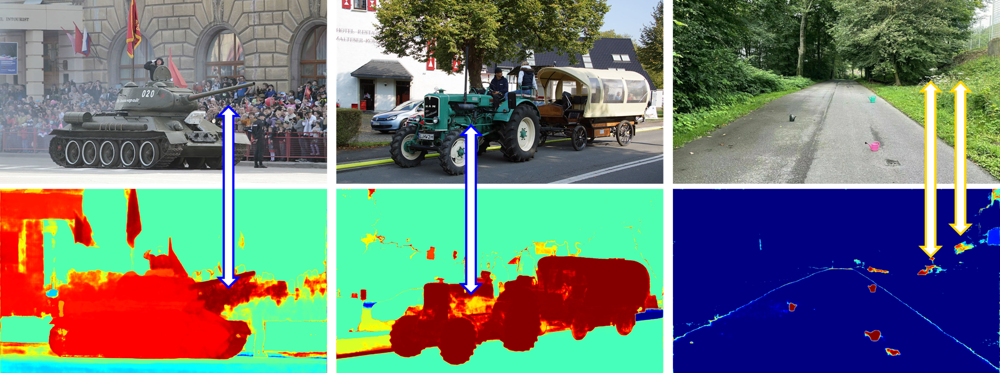
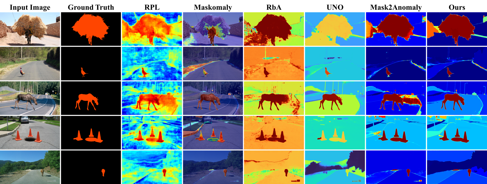

# Objectomaly: Objectness-Aware Refinement for OoD Segmentation with Structural Consistency and Boundary Precision

[Jeonghoon Song](modifying..), [Sunghun Kim](modifiying), [Jaegyun Im](https://github.com/imjaegyun), [Byeongjoon Noh](https://scholar.google.com/citations?hl=ko&user=0mPWzzIAAAAJ)

[[`Paper`](https://arxiv.org/abs/2507.07460)] [[`Dataset`](https://drive.usercontent.google.com/download?id=1NL_ApRB-MjVRrMw6ONYZTe1azXc_71yQ&export=download&authuser=0)] [[`BibTeX`](#Citing-Objectomoly)]



> **Objectomaly** is a post-hoc, training-free refinement framework for Out-of-Distribution (OoD) segmentation. It improves structural consistency and boundary precision by incorporating object-level priors through a three-stage pipeline: CAS, OASC, and MBP.

---

## Overview

Semantic segmentation models often struggle with unknown or unexpected objects, especially in safety-critical environments like autonomous driving. Existing OoD methods face challenges like:



- Inaccurate boundaries between adjacent objects (left)
- Lack of spatial consistency within anomaly scores of the same object (middle)
- Increase in false positives due to background noise (right)

---

## **Objectomaly** addresses these challenges through

### Three-Stage Refinement

1. **Coarse Anomaly Scoring (CAS):**
   Generates an initial anomaly map using a baseline OoD detector (e.g., Mask2Anomaly).
2. **Objectness-Aware Score Calibration (OASC):**
   Refines scores using instance masks from [Segment Anything Model (SAM)](https://github.com/facebookresearch/segment-anything) for intra-object consistency.
3. **Meticulous Boundary Precision (MBP):**
   Sharpens contours using Laplacian filtering and Gaussian smoothing.

---

## Benchmark Results

### Pixel-Level Metrics (AuPRC ↑ / FPR95 ↓)

| Dataset      | RPL           | Maskomaly     | UNO          | Mask2Anomaly  | **Objectomaly (Ours)** |
| ------------ | ------------- | ------------- | ------------ | ------------- | ---------------------- |
| **SMIYC AT** | 88.55 / 7.18  | 93.40 / 6.90  | 96.30 / 2.00 | 88.70 / 14.60 | **96.64 / 0.62**       |
| **SMIYC OT** | 96.91 / 0.09  | 0.96 / 96.14  | 93.20 / 0.20 | 93.30 / 0.20  | **96.99 / 0.07**       |
| **RA**       | 71.61 / 17.74 | 70.90 / 11.90 | 82.40 / 9.20 | 79.70 / 13.45 | **87.19 / 9.92**       |

### Component-Level Metrics (F1-score ↑)

| Dataset      | UNO   | Mask2Anomaly | **Objectomaly (Ours)** |
| ------------ | ----- | ------------ | ---------------------- |
| **SMIYC AT** | 58.87 | 47.16        | **60.83**              |
| **SMIYC OT** | 76.32 | 68.15        | **83.44**              |

---

## Qualitative Results

<p align="center">
  
</p>

## Installation

See [installation instructions](INSTALL.md).

## Datasets

📦 **Dataset Download**

You can download the anomaly segmentation datasets from the following [🔗link](https://drive.usercontent.google.com/download?id=1NL_ApRB-MjVRrMw6ONYZTe1azXc_71yQ&export=download&authuser=0)

📂 **Dataset Structure**

```
datasets/
├── fs_static
│ ├── images
│ └── labels_masks
├── RoadAnomaly
│ ├── images
│ └── labels_masks
├── RoadAnomaly21
│ ├── images
│ └── labels_masks
├── RoadObstacle21
│ ├── images
│ └── labels_masks
```

After downloading, unzip the files and place them under the `Objectomaly/datasets/` directory.

## Citing Objectomoly

If you use Objectomoly in your research, please use the following BibTeX entry.

```bibtex
@article{song2025objectomaly,
  title={Objectomaly: Objectness-Aware Refinement for OoD Segmentation with Structural Consistency and Boundary Precision},
  author={Song, Jeonghoon and Kim, Sunghun and Im, Jaegyun and Noh, Byeongjoon},
  journal={arXiv preprint arXiv:2507.07460},
  year={2025}
}
```

## Acknowledgement

We gratefully acknowledge the following repositories that greatly inspired and supported the development of Objectomaly:

- [Mask2Anomaly](https://github.com/shyam671/Mask2Anomaly-Unmasking-Anomalies-in-Road-Scene-Segmentation)
- [SAM](https://github.com/facebookresearch/segment-anything)
- [Mask2Former](https://github.com/facebookresearch/Mask2Former)
