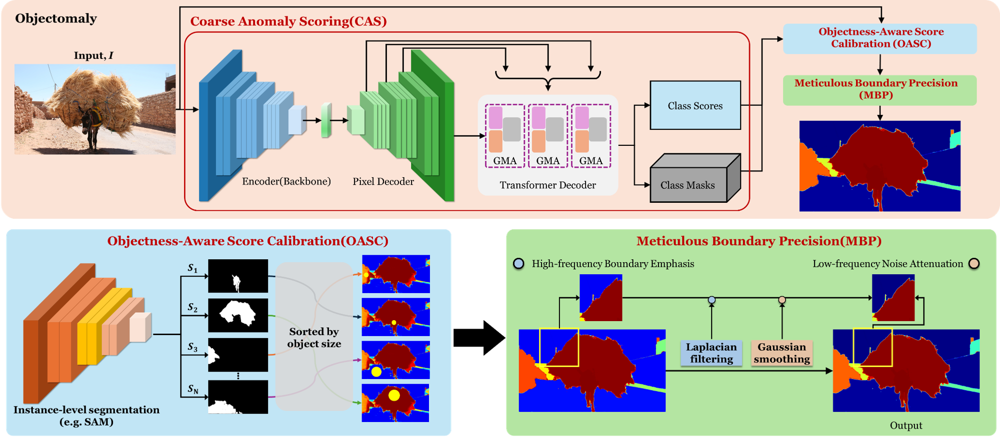
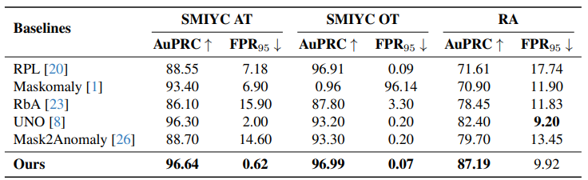
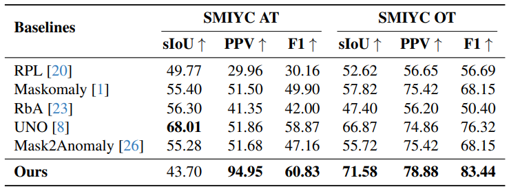

# Objectomaly: Objectness-Aware Refinement for OoD Segmentation with Structural Consistency and Boundary Precision

[Jeonghoon Song](modifying..), [Sunghun Kim](modifiying), [Jaegyun Im](https://github.com/imjaegyun), [Byeongjoon Noh](https://scholar.google.com/citations?hl=ko&user=0mPWzzIAAAAJ)

[[`Paper`](https://arxiv.org/abs/2507.07460)] [[`Dataset`](https://drive.usercontent.google.com/download?id=1NL_ApRB-MjVRrMw6ONYZTe1azXc_71yQ&export=download&authuser=0)] [[`BibTeX`](#Citing-Objectomoly)]



> **Objectomaly** is a post-hoc, training-free refinement framework for Out-of-Distribution (OoD) segmentation. It improves structural consistency and boundary precision by incorporating object-level priors through a three-stage pipeline: CAS, OASC, and MBP.

### Three-Stage Refinement

1. **Coarse Anomaly Scoring (CAS):**
   Generates an initial anomaly map using a baseline OoD detector (e.g., Mask2Anomaly).
2. **Objectness-Aware Score Calibration (OASC):**
   Refines scores using instance masks from [Segment Anything Model (SAM)](https://github.com/facebookresearch/segment-anything) for intra-object consistency.
3. **Meticulous Boundary Precision (MBP):**
   Sharpens contours using Laplacian filtering and Gaussian smoothing.

---

## Overview

Semantic segmentation models often struggle with unknown or unexpected objects, especially in safety-critical environments like autonomous driving. Existing OoD methods face challenges like:


- Inaccurate boundaries between adjacent objects (left)
- Lack of spatial consistency within anomaly scores of the same object (middle)
- Increase in false positives due to background noise (right)

## Quantitative Results

### Pixel-Level Metrics



### Component-Level Metrics



## Qualitative Results


## Usage

### Step 1 : git clone

```
git clone https://github.com/hon121215/Objectomaly.git
cd Objectomaly
```

### Step 2 : environment setup

- See [installation instructions](INSTALL.md).

### Step 3 : Weight File Download

After downloading the files below, modify the paths to each of them:

- [best_contrastive.pth](https://drive.usercontent.google.com/download?id=1TO8op0JvEhTzesbo3vcKbkmbPhcVmE47) → /Objectomaly/configs/cityscapes/semantic-segmentation/anomaly_inference.yaml
- [bt-f-xl.pth](https://drive.usercontent.google.com/download?id=1FaZAKCsTxYE5KBOlRgSb6q3eWFtdkSvp) → /Objectomaly/configs/cityscapes/semantic-segmentation/anomaly_ft.yaml
- [sam_vit_h_4b8939.pth](https://drive.usercontent.google.com/download?id=1ftcPwAs3zy5cD83Mhxoiw4kgjXmrZW39) → /Objectomaly/anomaly_utils/anomaly_inference.py

### Step 4 : Dataset Download

- You can download the anomaly segmentation datasets from the following [🔗link](https://drive.usercontent.google.com/download?id=1NL_ApRB-MjVRrMw6ONYZTe1azXc_71yQ&export=download&authuser=0)

**Dataset Structure**

```
datasets/
├── fs_static
│ ├── images
│ └── labels_masks
├── RoadAnomaly
│ ├── images
│ └── labels_masks
├── RoadAnomaly21
│ ├── images
│ └── labels_masks
├── RoadObstacle21
│ ├── images
│ └── labels_masks
```

After downloading, unzip the files and place them under the `Objectomaly/datasets/` directory.

### Step 5 : Inference

- Set the argument path for run.sh and run it

```
sh run.sh
```

## Docker Image

**Coming soon**

## Citing Objectomoly

If you use Objectomoly in your research, please use the following BibTeX entry.

```bibtex
@article{song2025objectomaly,
  title={Objectomaly: Objectness-Aware Refinement for OoD Segmentation with Structural Consistency and Boundary Precision},
  author={Song, Jeonghoon and Kim, Sunghun and Im, Jaegyun and Noh, Byeongjoon},
  journal={arXiv preprint arXiv:2507.07460},
  year={2025}
}
```

## Acknowledgement

We gratefully acknowledge the following repositories that greatly inspired and supported the development of Objectomaly:

- [Mask2Anomaly](https://github.com/shyam671/Mask2Anomaly-Unmasking-Anomalies-in-Road-Scene-Segmentation)
- [SAM](https://github.com/facebookresearch/segment-anything)
- [Mask2Former](https://github.com/facebookresearch/Mask2Former)
